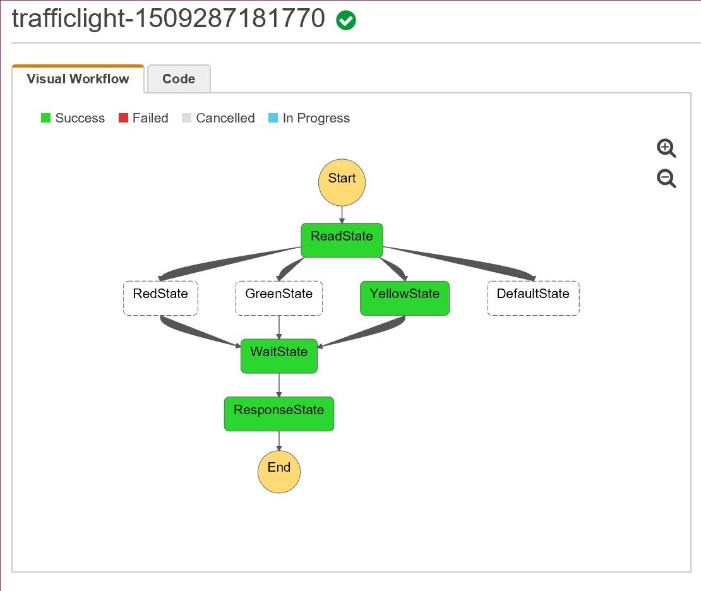

# Step Functions (Traffic Lights)



https://eu-west-1.console.aws.amazon.com/states/home?region=eu-west-1#

## Test

```bat
sls invoke -f entrypoint -data='{ "color":"green" }' --log
sls invoke -f entrypoint -data='{ "color":"yellow" }' --log
sls invoke -f entrypoint -data='{ "color":"red" }' --log
sls invoke -f entrypoint -data='{ "color":"blue" }' --log
```